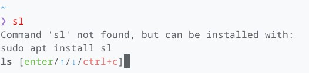

# the_fuck.fish [![ci-status]][ci-link] [![sponsors]][sponsor-link] [![MIT-img]][MIT]

[ci-link]: <https://github.com/edouard-lopez/the_fuck.fish/actions> "Github CI"
[ci-status]: https://img.shields.io/github/actions/workflow/status/edouard-lopez/the_fuck.fish/.github/workflows/ci.yml?style=flat-square
[sponsors]: https://img.shields.io/github/sponsors/edouard-lopez?label=💖&style=flat-square "GitHub Sponsors"
[sponsor-link]: https://github.com/sponsors/edouard-lopez/ "Become a sponsor"
[MIT]: LICENSE.md "MIT License"
[MIT-img]: https://img.shields.io/badge/license-MIT-blue.svg

> Automatically correct the last command using [thefuck](https://github.com/nvbn/thefuck).
>
> :bomb: This is a quick experimentation

<div align="center">




</div>

## Installation

```fish
fisher install edouard-lopez/the_fuck.fish
```

## Usage

This plugin automatically triggers **when a command fails** (returns a non-zero exit status). It attempts to correct the command using [`thefuck`](https://github.com/nvbn/thefuck).

### Disabling it

The plugin is enabled by default on new shell. You can disable with:

```fish
set --global THE_FUCK_ENABLED 0
```

### Enbling it

You can enable with:

```fish
set --global THE_FUCK_ENABLED 1
```

## Dependencies

- [thefuck](https://github.com/nvbn/thefuck) must be installed and in your PATH.

## [MIT](LICENSE) License
